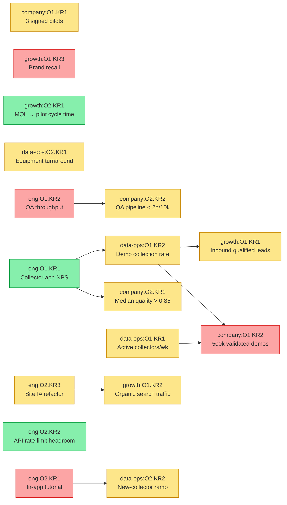

# Cross-team OKR dependencies

_Generated 2026-05-13. Do not hand-edit; regenerate with `/dependency-graph`._

## Schema errors

none

## Graph

## Critical chains

- `eng:O2.KR1` (red, in-app tutorial) → `data-ops:O2.KR2` (yellow, new-collector ramp)
- `eng:O1.KR2` (red, QA throughput) → `company:O2.KR2` (yellow, QA pipeline < 2h/10k)
- `eng:O2.KR3` (yellow, site IA) → `growth:O1.KR2` (yellow, organic traffic)
- `data-ops:O1.KR1` (yellow, active collectors) → `company:O1.KR2` (red, 500k validated demos)
- `data-ops:O1.KR2` (yellow, collection rate) → `company:O1.KR2` (red, 500k validated demos)

The cleanest signal in this graph: `company:O1.KR2` is red and its two
direct upstreams are both yellow. Either the upstream targets are too
soft, or the company-level target is too aggressive. Worth a founder
conversation before the midpoint review.
